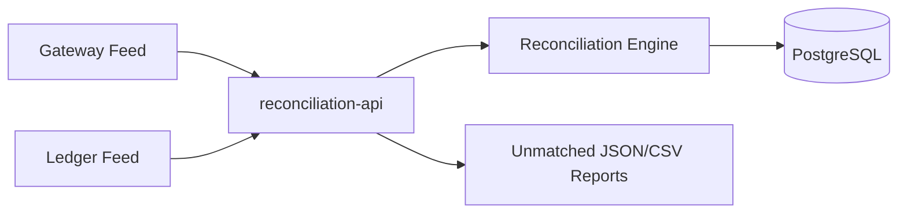

# Payments Reconciliation Service (Java + Spring Boot)

Backend service that reconciles payment gateway transactions against internal ledger entries, stores reconciliation runs, and exposes unmatched reports (JSON + CSV).

## Outcome

- Built reconciliation workflow that compares gateway and ledger records by transaction ID and amount.
- Added manual run endpoint plus hourly scheduled run support.
- Exposed unmatched exceptions as both API JSON and downloadable CSV.

## Architecture



## Stack

- Java 21
- Spring Boot 3
- PostgreSQL
- Docker Compose

## Run

```bash
cd payments-reconciliation-service
docker compose up -d
mvn spring-boot:run
```

## Endpoints

### Ingest gateway transaction

```bash
curl -X POST http://localhost:8083/api/reconciliation/gateway-transactions \
  -H 'Content-Type: application/json' \
  -d '{
    "transactionId":"TXN-2001",
    "amount":999.00,
    "occurredAt":"2026-03-11T00:00:00+05:30"
  }'
```

### Ingest ledger entry

```bash
curl -X POST http://localhost:8083/api/reconciliation/ledger-entries \
  -H 'Content-Type: application/json' \
  -d '{
    "transactionId":"TXN-2001",
    "amount":999.00,
    "bookedAt":"2026-03-11T00:05:00+05:30"
  }'
```

### Run reconciliation manually

```bash
curl -X POST http://localhost:8083/api/reconciliation/run
```

### Get latest run summary

```bash
curl http://localhost:8083/api/reconciliation/runs/latest
```

### Get unmatched JSON report

```bash
curl http://localhost:8083/api/reconciliation/reports/unmatched
```

### Download unmatched CSV report

```bash
curl -L -o unmatched-report.csv http://localhost:8083/api/reconciliation/reports/unmatched.csv
```

### Sample response (`POST /api/reconciliation/run`)

```json
{
  "timestamp": "2026-03-11T01:21:40+05:30",
  "status": 200,
  "message": "Reconciliation completed",
  "path": "/api/reconciliation/run",
  "data": {
    "runId": 6,
    "totalGateway": 1,
    "totalLedger": 1,
    "matchedCount": 0,
    "unmatchedCount": 1
  }
}
```

## Notes

- Scheduler runs every hour by default (`reconciliation.schedule.cron`).
- Seed data is included to generate matched and unmatched cases quickly.

## Deploy (Render)

This repo includes `render.yaml` + `Dockerfile`.

1. Connect repository to Render Blueprint deploy.
2. Provision API service and Postgres database from `render.yaml`.
3. Verify health endpoint `/actuator/health` after deploy.
